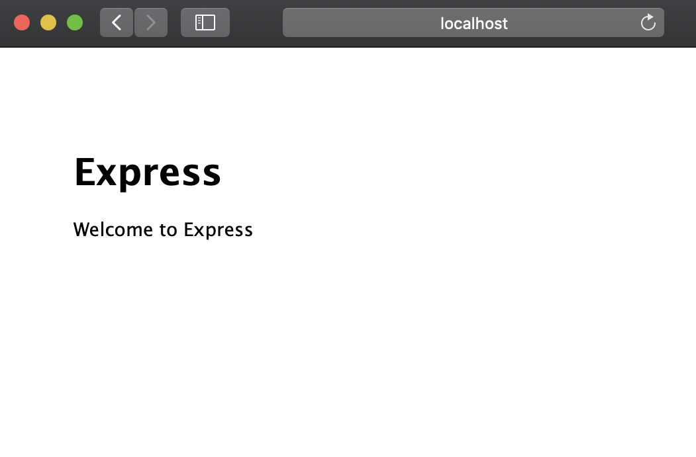
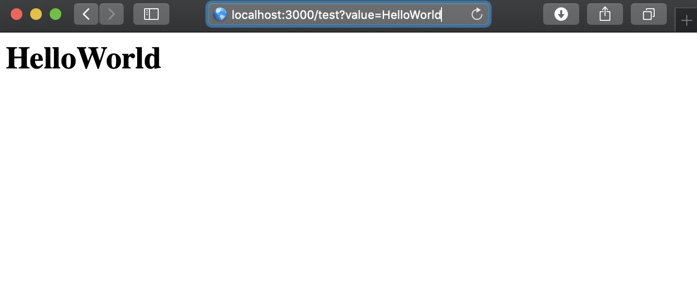
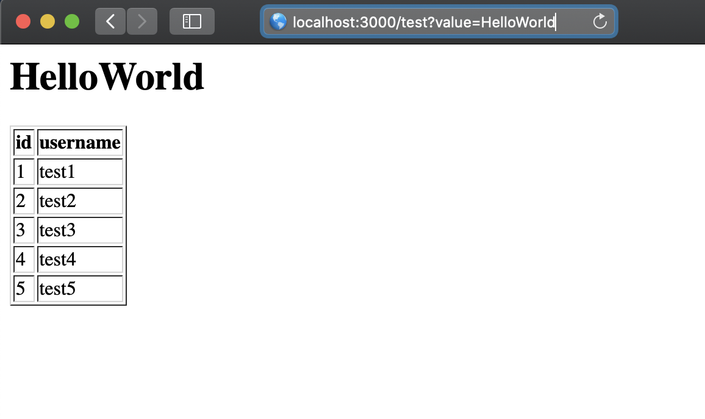

# make TodoApp
## 1. 導入
### 1. 雛形を生成してくれる`express-generator`を導入
```bash
npm install express-generator -g
```
### 2. `express-generator`で`TodoApp`(任意の名前)というアプリを作成  
- 今後の作業は`TodoApp`ディレクトリ下で行います
```bash
express TodoApp --view=ejs
```
### 3. ディレクトリ移動
```bash
cd TodoApp
```
### 4. 必要なパッケージのインストール
```bash
npm install --save passport passport-local express-session mysql connect-flash
```
```bash
npm install
```
***

## 2. install MySQL
### 1. install
```bash
brew install mysql
```
### 2. check version
```bash
mysql --version
```
- result
```bash
user@MacBook-Pro TodoApp % mysql --version
mysql  Ver 8.0.21 for osx10.15 on x86_64 (Homebrew)
```
***
## 3. Run MySQL server
### 1. start mysql server
MySQLサーバーを起動
```bash
mysql.server start
```
止めたい場合は
```bash
mysql.server stop
```

### 2. make root user
```bash
mysql_secure_installation
```
このコマンドで行うこと
- パスワード強度の設定
  - LOW : **8文字**以上
  - MEDIUM : LOWの条件+数字,アルファベットの大小文字,特殊文字を**それぞれ1つ**以上
  - STRONG : MEDIUMの条件+辞書ファイルでの確認
- rootアカウントのパスワード設定
- anonymousの削除
- testデータベースの削除

`y or n(Yes or No)`の質問は基本的に全て`y`を押す  
パスワード強度の設定では`MEDIUM`を推奨  
rootパスワードの設定は**自身が設定した強度のルール**に沿ったものにする必要がある


### 3. login mysql server
先ほど設定したパスワードを入力し`root`ユーザーでログイン
```bash
mysql -uroot -p
```

***
## 4. Set up database

### 1. make database
アプリで使用するデータベースを作成する  
`root`ユーザーでMySQLサーバーにログインした状態で行う  

SQLのコマンドは**大文字小文字は同じ文字**として認識される
```sql
mysql>CREATE DATABASE TODOAPP;
```
実際に打つコマンドは`mysql>`の右から,つまり`CREATE DATABASE TODOAPP;`のみ
### 2. use database
これから`TODOAPP`データベースを使うよ！と宣言
```sql
mysql>use TODOAPP;
```

### 3. make table
- テーブル構造はあとで説明します
#### make users table
```sql
mysql>create table users (id int not null primary key AUTO_INCREMENT, username varchar(20) not null unique, password varchar(20) not null, isAdmin boolean);
```
#### make tasks table
```sql
mysql>create table tasks (id int not null primary key AUTO_INCREMENT, title varchar(100) not null, message varchar(500) not null, percent int default 0,target int not null);
```

#### insert values
```sql
mysql>insert into users values (0,'user','password',False);
mysql>insert into tasks values (0,'hello','world',0,0);
```
### TIPS : AUTO_INCREMENT
>値に`null`か`0`を指定すると自動的に連番を割り当ててくれる  
>値の指定も可能(重複するとエラーが発生)  
>挿入エラーが発生しても自動的に1増やしてしまうため欠番が発生することがある  
>最大値は`signed int(11)`の2147483647  


#### show users table columns
```sql
mysql>show columns from users;
```
- result
```sql
mysql> show columns from users;
+----------+-------------+------+-----+---------+----------------+
| Field    | Type        | Null | Key | Default | Extra          |
+----------+-------------+------+-----+---------+----------------+
| id       | int         | NO   | PRI | NULL    | auto_increment |
| username | varchar(20) | NO   | UNI | NULL    |                |
| password | varchar(20) | NO   |     | NULL    |                |
| isAdmin  | tinyint(1)  | YES  |     | NULL    |                |
+----------+-------------+------+-----+---------+----------------+
4 rows in set (0.01 sec)
```

#### check table
実際に挿入したデータを確認したい時に使用
```sql
mysql>select * from users;
mysql>select * from tasks;
```
#### delete users table
テーブルを削除したいときに使用
```sql
mysql>drop table users;
mysql>drop table tasks;
```

### 4. advance
Node.jsからMySQL8.x系に接続する際にエラーが発生するため,MySQL8.x系を使用している人は以下のコードを実行  
`'password'`は自分で設定した`root`ユーザーのパスワードに変更
```sql
mysql>ALTER USER 'root'@'localhost' IDENTIFIED WITH mysql_native_password BY 'password';
```

***

## 5. Run TodoApp

### 1. Check directory structure
TodoAppディレクトリは以下のような構造になっています

```
.
├── app.js
├── bin
│   └── www
├── package.json
├── public
│   ├── images
│   ├── javascripts
│   └── stylesheets
│       └── style.css
├── routes
│   ├── index.js
│   └── users.js
└── views
    ├── error.ejs
    └── index.ejs

```
各項目の説明
- app.js
  - アプリのメインプログラム
  - アプリ全体に共通する処理や設定を書く
- bin
  - サーバープロセスの起動処理を行うディレクトリ
  - `npm start`では直下のwwwファイルを実行している
    - これは`package.json`にデフォルトで`"start": "node ./bin/www"`と記述されているため
- package.json
  - アプリの名前やパッケージの依存関係,バージョンを記述するJSONファイル
- public
  - JavaScriptやCSS,画像などの静的コンテンツを格納するディレクトリ
- routes
  - クライアントからの要求(GET,POST等)に対して,どのような処理を行うか記述するディレクトリ
- views
  - ejsファイルを格納するディレクトリ

### 2. Run 
アプリを実行するには
```bash
npm start
```
ブラウザから`localhost:3000`にアクセスし以下の画面が出れば成功



***
## 6. How to return response
Getリクエストで送られてきたクエリパラメータを表示する  
`localhost:3000/test`で実装する
### 1. Create test.js
- クエリパラメータは`req.query`で取得できる
- `value`の値を表示する
  - `localhost:3000/test?value='***'`のようにリクエストを送る 
- test.jsは`/routes`下に作成 

`test.js`
```js
var express = require('express');
var router = express.Router();

router.get('/', function(req, res, next) {
  var param = req.query.value;
  res.render('test',{'value':param});
});

module.exports = router;
```
- `res.render()`の第1引数には`/views`にある`ejs`ファイルを指定
- 第2引数には`ejs`ファイルに渡す変数を**連想配列**で渡す
### 2. About ejs
- `ejs`では`Html`ファイルに`JavaScript`の処理を埋め込むことができる
- `<% %>`で処理を囲むことができる 

以下の処理は`value = 'test'`の場合の結果となります
#### 2.1 display
- 変数の表示は`<%= value %>`で行う
```html
<p><%= value %></p>
```
#### result
```html
test
```

#### 2.2 if
- `<% %>`でif文を囲むことで変数によって処理を分岐することができる
```html
<%if(value == 'test')else%>
```
#### result
```html
True
```

#### 2.3 for 
- `<% %>`でfor文を囲むことで処理を繰り返し行うことができる
```html
<%for(var i = 0;i < 5;i++>){%>
  <p><%= i %>回目</p><br>
<%}%>
```
#### result
```html
0回目
1回目
2回目
3回目
4回目
```

### 3. Create test.ejs
- `/view`下に`test.ejs`を作成 
- `value`を表示

`test.ejs`
```html
<h1><%= value %></h1>

```


### 4. Edit app.js
- ルーティング処理とejsファイルを記述しても,`app.js`にルーティング情報を書かなければいけない
- 下記コードをそれぞれ`app.js`の適切な箇所に記述する
  - 似た処理を行っている箇所があるため,その下に記述する

```js
var testRouter = require('./routes/test');

app.use('/test',testRouter);
```
#### コードの解説
- `app.use`の第1引数に待ち受け場所のパスを,第2引数にルーターを渡す
  - 今回は`/test`へのリクエストを処理するため上のようになる
  - `/test`のルーターは`test.js`に記述してあるため,それを`require()`で呼び出す
### 5. Run

1-3の内容を使い`/test`のクエリパラメータ`value`の値を表示させてみましょう  
`npm start`でアプリを起動し,クエリパラメータ`value`に`HelloWorld`を渡してください  
以下のように`value`の値が表示されたら成功


*** 
## 7. How to connect SQL server

### 1. Create connection
- `app.js`と同じディレクトリに`dbConnect.js`を作成  
- dbConnect.jsの中身は以下の通り  
- dbConfigの`password`は自身で設定したもの  


`dbConfig.js`
```js
var mysql = require('mysql');
var dbConfig = {
        host:'localhost',
        user:'root',
        password:'password',
        database:'TODOAPP'
    };
var connection = mysql.createConnection(dbConfig);

connection.connect(function(err){
    if(err){
        console.log('error connectig:' + err.stack);
        return;
    }
    console.log('Connect Success');
});

module.exports = connection;
```
コードの説明
- `mysql`モジュールの`createConnection`でMySQLサーバーと接続
- `dbConfig`にデータベースへの接続情報を記述
- `connection.connect`で接続時のエラー処理を記入
- `module.exports = connection`で他のファイルから変数`connection`を使えるように

### TIPS : module.exports
> `module.exports`にオブジェクトを代入することで,他のファイルから`require()`で読み込んだ際に代入したオブジェクトを使用することができる  
>上の`connection`を使うには  
> ```js
>var connection = require('./dbConnect');
>```  
>を使用したいファイルで宣言する必要がある  
>注意
>- `dbConnect.js`が同じ階層に無い場合にはパスを変更する
>- `/routes/index.js`から読み込む際には`../dbConnect`に変更する


## 8. How to get SQL data

### 1. How to use connection.query
- 第1引数には実行するSQL文,第2引数には処理を記述した関数を渡す  
- SQLからデータを取得するためにはSQL文を書く必要がある
```js
connection.query('SQL文',
  function(error,results,fields){
    //処理を書いていく
    //errorにはエラー
    //resultsにはSQL文の実行結果
    //fieldsは各フィールドの詳細
});
``` 
### usersテーブルのデータを取得したい時  

```js
connection.query('SELECT * from users;',
  function(error,results,fields){
    if(error){
      //error処理
    }
    else{
      //usersにデータベースのusersテーブルの内容が代入される
      var users = Object.values(JSON.parse(JSON.stringify(results)));
      console.log(users);
    }
});
```
### 注意点
>- resultsは`RowDataPacket`オブジェクト
>- 普通の配列に変換するには`Object.values(JSON.parse(JSON.stringify(results)));`を使用
>- ファイルの中で`var connection = require('./dbConfig');`を宣言しないと使えない

### 2. How to display
- `test.js`,`test.ejs`を変更 

`test.js`
```js
var express = require('express');
var router = express.Router();
var connection = require('../dbConnect');

router.get('/', function(req, res, next) {
  connection.query('SELECT * from users;',
  function(error,results,fields){
    if(error){
      //error処理
      throw err;
    }
    else{
      //usersにデータベースのusersテーブルの内容が代入される
      var users = Object.values(JSON.parse(JSON.stringify(results)));
      var param = req.query.value;
      res.render('test',{'value':param,'users':users});
    }
  });
});

module.exports = router;
```

`test.ejs`
```html
<h1><%= value%></h1>

<table border=1>
    <thead>
      <tr>
        <th>id</th>
        <th>username</th>
      </tr>
    </thead>
    <tbody>  
      <% for(var user of users){ %>
        <tr>
            <td><%= user.id%></td>
            <td><%= user.username%></td>
        </tr>
      <% }%>
    </tbody>
</table>
```

#### Databaseに値を挿入する
- まだデータベースに値が入っていないため何も表示されない

mysqlで以下のコードを実行
```sql
-- 使用するデータベースを指定
mysql>use TODOAPP;
-- usersテーブルに以下のユーザーを追加
mysql>insert into users values (0,'test1','password',False);
mysql>insert into users values (0,'test2','password',False);
mysql>insert into users values (0,'test3','password',False);
mysql>insert into users values (0,'test4','password',False);
mysql>insert into users values (0,'test5','password',False);
```
test1-test5ユーザーが登録された

### 3. Run

実行し`localhost:3000/test?value=HelloWorld`へアクセス  
以下のようになれば成功



## 9. How to authorize