# make TodoApp
## 1. 導入
### 1. 雛形を生成してくれる`express-generator`を導入
```bash
npm install express-generator -g
```
### 2. `express-generator`で`TodoApp`(任意の名前)というアプリを作成  
- 今後の作業は`TodoApp`ディレクトリ下で行います
```bash
express TodoApp --view=ejs
```
### 3. ディレクトリ移動
```bash
cd TodoApp
```
### 4. 必要なパッケージのインストール
```bash
npm install --save passport passport-local express-session mysql connect-flash
```
```bash
npm install
```
***

## 2. install MySQL
### 1. install
```bash
brew install mysql
```
### 2. check version
```bash
mysql --version
```
- result
```bash
user@MacBook-Pro TodoApp % mysql --version
mysql  Ver 8.0.21 for osx10.15 on x86_64 (Homebrew)
```
***
## 3. Run MySQL server
### 1. start mysql server
MySQLサーバーを起動
```bash
mysql.server start
```
止めたい場合は
```bash
mysql.server stop
```

### 2. make root user
```bash
mysql_secure_installation
```
このコマンドで行うこと
- パスワード強度の設定
  - LOW : **8文字**以上
  - MEDIUM : LOWの条件+数字,アルファベットの大小文字,特殊文字を**それぞれ1つ**以上
  - STRONG : MEDIUMの条件+辞書ファイルでの確認
- rootアカウントのパスワード設定
- anonymousの削除
- testデータベースの削除

`y or n(Yes or No)`の質問は基本的に全て`y`を押す  
パスワード強度の設定では`MEDIUM`を推奨  
rootパスワードの設定は**自身が設定した強度のルール**に沿ったものにする必要がある


### 3. login mysql server
先ほど設定したパスワードを入力し`root`ユーザーでログイン
```bash
mysql -uroot -p
```

***
## 4. Set up database

### 1. make database
アプリで使用するデータベースを作成する  
`root`ユーザーでMySQLサーバーにログインした状態で行う  

SQLのコマンドは**大文字小文字は同じ文字**として認識される
```sql
mysql>CREATE DATABASE TODOAPP;
```
実際に打つコマンドは`mysql>`の右から,つまり`CREATE DATABASE TODOAPP;`のみ
### 2. use database
これから`TODOAPP`データベースを使うよ！と宣言
```sql
mysql>use TODOAPP;
```

### 3. make table
- テーブル構造はあとで説明します
#### make users table
```sql
mysql>create table users (id int not null primary key AUTO_INCREMENT, username varchar(100) not null unique, password varchar(100) not null, isAdmin boolean default false);
```
#### make tasks table
```sql
mysql>create table tasks (id int not null primary key AUTO_INCREMENT, title varchar(100) not null, message varchar(500) not null, percent int default 0,target int not null);
```

#### insert values
```sql
mysql>insert into users values (0,'user','password',False);
mysql>insert into tasks values (0,'hello','world',0,0);
```
### TIPS : AUTO_INCREMENT
>値に`null`か`0`を指定すると自動的に連番を割り当ててくれる  
>値の指定も可能(重複するとエラーが発生)  
>挿入エラーが発生しても自動的に1増やしてしまうため欠番が発生することがある  
>最大値は`signed int(11)`の2147483647  


#### show users table columns
```sql
mysql>show columns from users;
```
- result
```sql
mysql> show columns from users;
+----------+-------------+------+-----+---------+----------------+
| Field    | Type        | Null | Key | Default | Extra          |
+----------+-------------+------+-----+---------+----------------+
| id       | int         | NO   | PRI | NULL    | auto_increment |
| username | varchar(20) | NO   | UNI | NULL    |                |
| password | varchar(20) | NO   |     | NULL    |                |
| isAdmin  | tinyint(1)  | YES  |     | NULL    |                |
+----------+-------------+------+-----+---------+----------------+
4 rows in set (0.01 sec)
```

#### check table
実際に挿入したデータを確認したい時に使用
```sql
mysql>select * from users;
mysql>select * from tasks;
```
#### delete users table
テーブルを削除したいときに使用
```sql
mysql>drop table users;
mysql>drop table tasks;
```

### 4. advance
Node.jsからMySQL8.x系に接続する際にエラーが発生するため,MySQL8.x系を使用している人は以下のコードを実行  
`'password'`は自分で設定した`root`ユーザーのパスワードに変更
```sql
mysql>ALTER USER 'root'@'localhost' IDENTIFIED WITH mysql_native_password BY 'password';
```

***

## 5. Run TodoApp

### 1. Check directory structure
TodoAppディレクトリは以下のような構造になっています

```
.
├── app.js
├── bin
│   └── www
├── package.json
├── public
│   ├── images
│   ├── javascripts
│   └── stylesheets
│       └── style.css
├── routes
│   ├── index.js
│   └── users.js
└── views
    ├── error.ejs
    └── index.ejs

```
各項目の説明
- app.js
  - アプリのメインプログラム
  - アプリ全体に共通する処理や設定を書く
- bin
  - サーバープロセスの起動処理を行うディレクトリ
  - `npm start`では直下のwwwファイルを実行している
    - これは`package.json`にデフォルトで`"start": "node ./bin/www"`と記述されているため
- package.json
  - アプリの名前やパッケージの依存関係,バージョンを記述するJSONファイル
- public
  - JavaScriptやCSS,画像などの静的コンテンツを格納するディレクトリ
- routes
  - クライアントからの要求(GET,POST等)に対して,どのような処理を行うか記述するディレクトリ
- views
  - ejsファイルを格納するディレクトリ

### 2. Run 
アプリを実行するには
```bash
npm start
```
ブラウザから`localhost:3000`にアクセスし以下の画面が出れば成功


***
## 6. How to return response
Getリクエストで送られてきたクエリパラメータを表示する  
`localhost:3000/test`で実装する
### 1. Create test.js
- クエリパラメータは`req.query`で取得できる
- `value`の値を表示する
  - `localhost:3000/test?value='***'`のようにリクエストを送る 
- test.jsは`/routes`下に作成 

`test.js`
```js
var express = require('express');
var router = express.Router();

router.get('/', function(req, res, next) {
  var param = req.query.value;
  res.render('test',{'value':param});
});

module.exports = router;
```
- `res.render()`の第1引数には`/views`にある`ejs`ファイルを指定
- 第2引数には`ejs`ファイルに渡す変数を**連想配列**で渡す
### 2. About ejs
- `ejs`では`Html`ファイルに`JavaScript`の処理を埋め込むことができる
- `<% %>`で処理を囲むことができる 

以下の処理は`value = 'test'`の場合の結果となります
#### 2.1 display
- 変数の表示は`<%= value %>`で行う
```html
<p><%= value %></p>
```
#### result
```html
test
```

#### 2.2 if
- `<% %>`でif文を囲むことで変数によって処理を分岐することができる
```html
<%if(value == 'test')else%>
```
#### result
```html
True
```

#### 2.3 for 
- `<% %>`でfor文を囲むことで処理を繰り返し行うことができる
```html
<%for(var i = 0;i < 5;i++>){%>
  <p><%= i %>回目</p><br>
<%}%>
```
#### result
```html
0回目
1回目
2回目
3回目
4回目
```

### 3. Create test.ejs
- `/view`下に`test.ejs`を作成 
- `value`を表示

`test.ejs`
```html
<h1><%= value %></h1>

```


### 4. Edit app.js
- ルーティング処理とejsファイルを記述しても,`app.js`にルーティング情報を書かなければいけない
- 下記コードをそれぞれ`app.js`の適切な箇所に記述する
  - 似た処理を行っている箇所があるため,その下に記述する

```js
var testRouter = require('./routes/test');

app.use('/test',testRouter);
```
#### コードの解説
- `app.use`の第1引数に待ち受け場所のパスを,第2引数にルーターを渡す
  - 今回は`/test`へのリクエストを処理するため上のようになる
  - `/test`のルーターは`test.js`に記述してあるため,それを`require()`で呼び出す
### 5. Run

1-3の内容を使い`/test`のクエリパラメータ`value`の値を表示させてみましょう  
`npm start`でアプリを起動し,クエリパラメータ`value`に`HelloWorld`を渡してください  
以下のように`value`の値が表示されたら成功


*** 
## 7. How to connect SQL server

### 1. Create connection
- `app.js`と同じディレクトリに`dbConnect.js`を作成  
- dbConnect.jsの中身は以下の通り  
- dbConfigの`password`は自身で設定したもの  


`dbConfig.js`
```js
var mysql = require('mysql');
var dbConfig = {
        host:'localhost',
        user:'root',
        password:'password',
        database:'TODOAPP'
    };
var connection = mysql.createConnection(dbConfig);

connection.connect(function(err){
    if(err){
        console.log('error connectig:' + err.stack);
        return;
    }
    console.log('Connect Success');
});

module.exports = connection;
```
コードの説明
- `mysql`モジュールの`createConnection`でMySQLサーバーと接続
- `dbConfig`にデータベースへの接続情報を記述
- `connection.connect`で接続時のエラー処理を記入
- `module.exports = connection`で他のファイルから変数`connection`を使えるように

### TIPS : module.exports
> `module.exports`にオブジェクトを代入することで,他のファイルから`require()`で読み込んだ際に代入したオブジェクトを使用することができる  
>上の`connection`を使うには  
> ```js
>var connection = require('./dbConnect');
>```  
>を使用したいファイルで宣言する必要がある  
>注意
>- `dbConnect.js`が同じ階層に無い場合にはパスを変更する
>- `/routes/index.js`から読み込む際には`../dbConnect`に変更する


## 8. How to get SQL data

### 1. How to use connection.query
- 第1引数には実行するSQL文,第2引数には処理を記述した関数を渡す  
- SQLからデータを取得するためにはSQL文を書く必要がある
```js
connection.query('SQL文',
  function(error,results,fields){
    //処理を書いていく
    //errorにはエラー
    //resultsにはSQL文の実行結果
    //fieldsは各フィールドの詳細
});
``` 
### usersテーブルのデータを取得したい時  

```js
connection.query('SELECT * from users;',
  function(error,results,fields){
    if(error){
      //error処理
    }
    else{
      //usersにデータベースのusersテーブルの内容が代入される
      var users = Object.values(JSON.parse(JSON.stringify(results)));
      console.log(users);
    }
});
```
### 注意点
>- resultsは`RowDataPacket`オブジェクト
>- 普通の配列に変換するには`Object.values(JSON.parse(JSON.stringify(results)));`を使用
>- ファイルの中で`var connection = require('./dbConfig');`を宣言しないと使えない

### 2. How to display
- `test.js`,`test.ejs`を変更 

`test.js`
```js
var express = require('express');
var router = express.Router();
var connection = require('../dbConnect');

router.get('/', function(req, res, next) {
  connection.query('SELECT * from users;',
  function(error,results,fields){
    if(error){
      //error処理
      throw err;
    }
    else{
      //usersにデータベースのusersテーブルの内容が代入される
      var users = Object.values(JSON.parse(JSON.stringify(results)));
      var param = req.query.value;
      res.render('test',{'value':param,'users':users});
    }
  });
});

module.exports = router;
```

`test.ejs`
```html
<h1><%= value%></h1>

<table border=1>
    <thead>
      <tr>
        <th>id</th>
        <th>username</th>
      </tr>
    </thead>
    <tbody>  
      <% for(var user of users){ %>
        <tr>
            <td><%= user.id%></td>
            <td><%= user.username%></td>
        </tr>
      <% }%>
    </tbody>
</table>
```

#### Databaseに値を挿入する
- まだデータベースに値が入っていないため何も表示されない

mysqlで以下のコードを実行
```sql
-- 使用するデータベースを指定
mysql>use TODOAPP;
-- usersテーブルに以下のユーザーを追加
mysql>insert into users values (0,'test1','password',False);
mysql>insert into users values (0,'test2','password',False);
mysql>insert into users values (0,'test3','password',False);
mysql>insert into users values (0,'test4','password',False);
mysql>insert into users values (0,'test5','password',False);
```
test1-test5ユーザーが登録された

### 3. Run

実行し`localhost:3000/test?value=HelloWorld`へアクセス  
以下のようになれば成功


## 9. How to authorize
### 1. Introduction
- 下記のコードを`app.js`に追加
```js
var passport = require('passport');
app.use(passport.initialize());
```
### 2. Local Strategy
`Local Strategy`を使いユーザー認証を行う
- 下記のコードを`app.js`に追加
- `username`が`test`&& `password`が`test`のとき認証が成功するコード
```js
var passport = require('passport');
var LocalStrategy = require('passport-local').Strategy;

passport.use(new LocalStrategy(function(username,password,done){
  if(username == 'test' && password == 'test'){
    return done(null,true);
  }
  else{
    return done(null,false,{message:'login failured'});
  }
}))
```

### 3. Make Login & Logout & Register Page

#### Login
`login.ejs`と`login.js`を追加  

`views/login.ejs`
```html
<!DOCTYPE html>
<html>
  <body>
      <h1>Login Page</h1>
      <form action="/login" method="post">
        <div>
            <label>UserName：</label>
            <input type="text" name="username"/>
        </div>
        <div>
            <label>Password：</label>
            <input type="password" name="password"/>
        </div>
        <div>
            <input type="submit" value="Login"/>
        </div>
      </form>
  </body>
</html>

```
`routes/login.js`
```js
var express = require('express');
var router = express.Router();
var passport = require('passport');

router.get('/',function(req,res,next){
    res.render('login');
});

router.post('/', passport.authenticate('local', {
    successRedirect: '/',
    failureRedirect: '/login',
    session:false
  }
));

module.exports = router;
```
#### Logout
`logout.js`を追加  
- Logout処理は`req.logout()`で簡単に行うことができる

`views/logout.js`
```js
var express = require('express');
var router = express.Router();

router.get('/', function(req, res, next) {
  if(req.isAuthenticated()){
    req.logout();
    res.redirect('/');
  }
  else{
    res.redirect('login');
  }
});

module.exports = router;
```
#### Register
`register.js`,`register.ejs`を追加  
- POSTされた内容を`insert`でSQLに挿入

`register.js`
```js
var express = require('express');
var router = express.Router();
var connection = require('../dbConnect');

router.get('/',function(req,res,next){
    res.render('register',{errorMessage:''});
});

router.post('/', function(req,res,next){
    let username = req.body.username,
        password = req.body.password;
    if(username == ''){
        res.render('register',{errorMessage:'invalid username'});
    }
    else if(password == ''){
        res.render('register',{errorMessage:'invalid password'});
    }
    else {
        connection.query(`insert into users values (0,'${username}','${password}',False);`,function(err,result,fields){
            if(err){
                res.render('register',{errorMessage:`This username(${username}) is already used`});
            }
            else{
                res.redirect('/');
            }
        });
    }
});
module.exports = router;
```
`register.ejs`
- エラーメッセージを表示するために引数に`errorMessage`を使用
```html
<!DOCTYPE html>
<html>
  <head>
    <link href="https://stackpath.bootstrapcdn.com/bootstrap/4.3.1/css/bootstrap.min.css" rel="stylesheet">
    <link href="https://use.fontawesome.com/releases/v5.6.1/css/all.css" rel="stylesheet">
    <script src="https://code.jquery.com/jquery-3.3.1.slim.min.js" ></script>
    <script src="https://stackpath.bootstrapcdn.com/bootstrap/4.1.2/js/bootstrap.min.js"></script>
    <script src="https://cdnjs.cloudflare.com/ajax/libs/popper.js/1.14.3/umd/popper.min.js"></script>
  </head>
  <body>
      <h1>Register Page</h1>
      <%if(errorMessage != ''){%>
        <div class="alert alert-danger">
          <strong>Warning!</strong>  <%= errorMessage%>
        </div>
      <%}%>
      <form action="/register" method="post">
        <div>
            <label>UserName：</label>
            <input type="text" name="username"/>
        </div>
        <div>
            <label>Password：</label>
            <input type="password" name="password"/>
        </div>
        <div>
            <input type="submit" value="Register"/>
        </div>
      </form>
  </body>
</html>
```

- Routerをapp.jsで追加

```js
var loginRouter = require('./routes/login');
var logoutRouter = require('./routes/logout');
var registerRouter = require('./routes/register');

app.use('/login',loginRouter);
app.use('/logout',logoutRouter);
app.use('/register',registerRouter);
```

### check

#### Login
- `localhost:3000/login`にアクセス
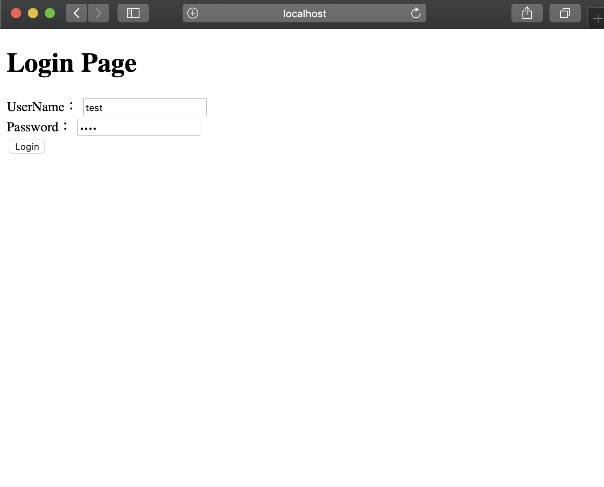
- `username`,`password`に`test`を入力し,以下のようにindexページに飛んだらログイン処理成功
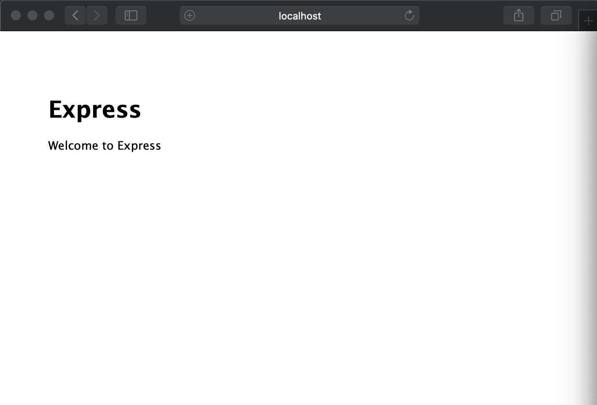

- ログインに失敗すると`/login`に戻される
#### Logout
- `localhost:3000/logout`にアクセス

確認するには
- `localhost:3000/`にリダイレクトされる
- `localhost:3000/login`にアクセスし、ログインページが出る

この2つが成功すればOK

#### Register
- `localhost:3000/register`にアクセス

ユーザー`test100`を作成
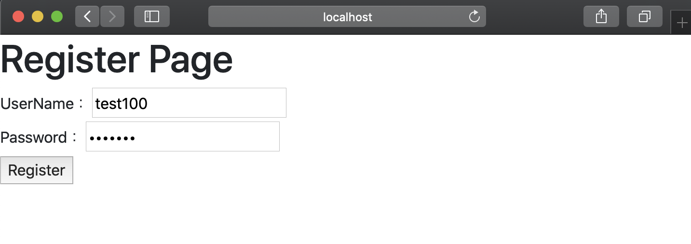

`localhost:3000/login`で作成したユーザーでログインできればOK

### 4. Use Database data
データベースの`users`テーブルに登録した内容でログイン処理を行う
#### `app.js`への追加項目
```js
var connection = require('./dbConnect');
```
- `passport.use`を変更
```js
passport.use(new LocalStrategy({
    //今回の実装では省略しても良い
    usernameField: "username", 
    passwordField: "password", 
  },function(username, password, done) {
    connection.query(`select * from users where username="${username}"`,function(err,users){
      if(users != undefined && users.length == 1 && users[0].password == password){
        return done(null,users[0]);
      }
      else if(users.length == 0){
        //"Invalid UserName"
        return done(null,false);
      }
      else{
        //"Invalid Password"
        return done(null,false);
      }
    });
  }
));
```
コードの解説  
- `LocalStrategy()`は認証情報を`username`と`password`のパラメータ名で確認している
- `LocalStrategy()`の第1引数には別のパラメータ名で確認させる場合に使用
  - デフォルトのパラメータ名を使っている場合は必要ない
  - POSTで送るユーザー名を`uname`,パスワードを`pw`で使っている場合  
```js
new LocalStrategy({
    usernameField: "uname", 
    passwordField: "pw", 
  },function(username, password, done) {
   //処理
  }
));
```
 
- `LocalStrategy()`の第2引数には処理を記述
  - 内部で`connect`を用いSQLからデータを引き出し認証する
  - `select * from users where username="${username}"`で同じユーザー名のデータを取得
  - パスワードが同じ場合,`done(null,users[0])`を返す
    - `users`は配列のため,`users[0]`でユーザー情報にアクセス
  - 違う場合,`done(null,false)`を返す

#### check
3のcheckと同様に`/login`で確認  

> mysqlで以下のコードを実行
> ```sql
> -- 使用するデータベースを指定
> mysql>use TODOAPP;
> -- usersテーブルに以下のユーザーを追加
> mysql>insert into users values (0,'test1','password',False);
> mysql>insert into users values (0,'test2','password',False);
> mysql>insert into users values (0,'test3','password',False);
> mysql>insert into users values (0,'test4','password',False);
> mysql>insert into users values (0,'test5','password',False);
> ```
ここで追加したいずれかのユーザーでログイン可能か確認


### 5. Add session
セッションを保持する処理を加える

`app.js`に追加
```js
var session = require('express-session');

app.use(session({
  secret: 'secret',
  resave: false,
  saveUninitialized: false,
  cookie: {
    maxAge: 60 * 60 * 1000
  }
}));

app.use(passport.initialize());
app.use(passport.session());

passport.serializeUser(function(user, done) {
  done(null, user);
});
passport.deserializeUser(function(user, done) {
  done(null, user);
});

```
コードの解説
- session({...})について
  - [express-session](https://github.com/expressjs/session)のREADMEから抜粋
  - secret
    - `cookie`に署名するために使用されるもの
    - **推測できない文字列**にすることが推奨されている
  - resave
    - セッションが変更されなかった場合でも,セッションをセッションストア強制的に保存するかどうか
    - 基本は`false`
  - saveUninitialized
    - **初期化されていない**セッションを強制的にセッションストアに保存するかどうか
    - 基本は`false`
  - cookie
    - cookieの設定オブジェクト
    - cookie.maxAge
      - cookieの有効期限をミリ秒で設定


`routes/login.js`を変更
- ` session:false`を削除
```js
router.post('/', passport.authenticate('local', {
    successRedirect: '/',
    failureRedirect: '/login',
  }
));
```

### 6. Show error message
- Loginに失敗した際にエラーメッセージを出したい
- `connect-flash`を使う

追加内容
```js
var flash = require('connect-flash');

app.use(flash());

```
変更内容
- エラーメッセージを出力するために`login.ejs`,`login.js`,`app.js`を変更

`login.ejs`
- headに[Bootstrap4](https://getbootstrap.jp)を追加
```html
<head>
  <link href="https://stackpath.bootstrapcdn.com/bootstrap/4.3.1/css/bootstrap.min.css" rel="stylesheet">
</head>
```
- `<h1>Login Page</h1>`の下に追加
```html
<%if(errorMessage != ''){%>
  <div class="alert alert-danger">
    <strong>Warning!</strong>  <%= errorMessage%>
  </div>
<%}%>
```

`login.js`  
- `router.get`,`router.post`を変更
```js
router.get('/',function(req,res,next){
    res.render('login',{errorMessage:req.flash('error')});
});

router.post('/', passport.authenticate('local', {
    successRedirect: '/',
    failureRedirect: '/login',
    failureFlash: true
  }
));

```
`app.js`
- `passport.use()`を変更

```js
passport.use(new LocalStrategy({
    usernameField: "username", 
    passwordField: "password", 
  },function(username, password, done) {
    connection.query(`select * from users where username="${username}"`,function(err,users){
      if(users != undefined && users.length == 1 && users[0].password == password){
        return done(null,users[0]);
      }
      else if(users.length == 0){
        return done(null,false,{message:"Invalid UserName"});
      }
      else{
        return done(null,false,{message:"Invalid Password"});
      }
    });
  }
));
```
### **WARNING**
>`app.js`の
>```js
>app.use('/', indexRouter);
>app.use('/users', usersRouter);
>app.use('/test',testRouter);
>app.use('/login',loginRouter);
>``` 
>は
>```js
>app.use(session({
>  secret: 'secret',
>  resave: false,
>  saveUninitialized: false,
>  cookie: {
>    maxAge: 60 * 60 * 1000
>  }
>}));
>```
>より下に記述しないと`req.flash() requires sessions`とエラーが出ます

#### check
- `/login`で登録していないユーザーを入力
- 下記のようになれば成功
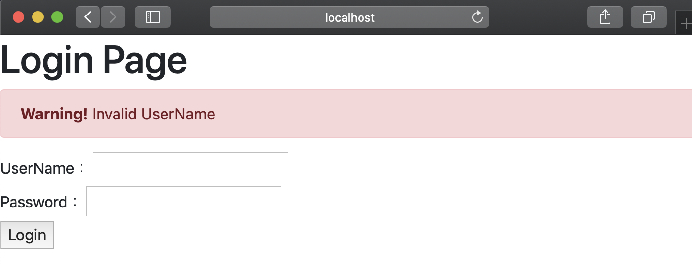

## 10. TodoApp Design
ここまで学んだ内容でTodoアプリを作ることができます.  
今回は**自身のタスクを確認でき,進捗を設定できる**一般ユーザーと,**それに加えタスクを生成できる**管理者ユーザーがいるTodoアプリを作成してみましょう!  
まずはTodoアプリに必要なものを考えてみましょう.  
### 1. Table structure
#### 1. User
ユーザーに必要なものは
- ユーザーid(プライマリーキー)
- ユーザーネーム
- パスワード
- ユーザーの種別  

となります.  
この内容をテーブルにしたものが先ほど作成した`users`テーブルです.
```sql
create table users (id int not null primary key AUTO_INCREMENT, username varchar(100) not null unique, password varchar(100) not null, isAdmin boolean default false);
```

#### 2. Task
タスクに必要なものは
- タスクID
- タスクのタイトル
- タスクの内容
- 達成率
- タスクの対象ユーザー(ID)

となります.  
この内容をテーブルにしたものが`tasks`テーブルです.
```sql
create table tasks (id int not null primary key AUTO_INCREMENT, title varchar(100) not null, message varchar(500) not null, percent int default 0,target int not null);
```

### 2. Necessary function
Todoアプリに必要なテーブル構造を作ることができました.  
次は必要な機能を考えてみましょう.  
 - タスクを確認できるページ
 - タスクの進捗を設定できるページ
 - 管理者のみアクセス可能なタスク生成ページ

 これらが必須機能となります.

 #### 1. タスクを確認できるページ
 まず前提条件として,タスクは自分が対象のモノのみ見れるものとします.  
このページは`tasks`テーブルから,ログインしたアカウントの`id`とtasksの`target`が同じデータを取得し,表示することで作成できます.  
表示するページを`mypage`とし作成していきます.  
`app.js`に`mypageRouter`と`app.use('/mypage',mypageRouter)`を追加を忘れないようにしてください.  
`mypage.ejs`と`mypage.js`を追加します. 

`mypage.ejs`
```html
<!DOCTYPE html>
<html>
  <head>
    <link href="https://stackpath.bootstrapcdn.com/bootstrap/4.3.1/css/bootstrap.min.css" rel="stylesheet">
    <script src="https://code.jquery.com/jquery-3.3.1.slim.min.js" ></script>
    <script src="https://stackpath.bootstrapcdn.com/bootstrap/4.1.2/js/bootstrap.min.js"></script>
  </head>
  <body>
    <h2>Hello, <%= username%></h2>
    <hr>
    <h2>My Tasks</h2>
    <table class='table table-bordered'>
        <thead class='thead-light'>
            <tr>
              <th>title</th>
              <th>message</th>
              <th>percent</th>
            </tr>
        </thead>
        <tbody>
            <% for(let task of tasks){ %>
                <tr>
                  <td><%= task.title%></td>
                  <td><%= task.message%></td>
                  <td><%= task.percent%></td>
                </tr>
            <% }%>
        </tbody>
    </table>
  </body>
</html>
```
`mypage.js`
```js
var express = require('express');
var router = express.Router();
var connection = require('../dbConnect');

router.get('/', function(req, res, next) {
  if(req.isAuthenticated()){
    var target = req.user.id;
    connection.query(`select * from tasks where target=${target};`,function(err,result,field){
        if(err){
            //error処理
        }
        else{
            var tasks = Object.values(JSON.parse(JSON.stringify(result)));
            var username = req.user.username;
            var isAdmin = req.user.isAdmin;
            res.render('mypage',{'tasks':tasks,'username':username});
        }
    });
  }
  else{
    res.redirect('login');
  }
});
module.exports = router;
```
#### result
`test1`でログインしたときの`localhost:3000/mypage`の結果
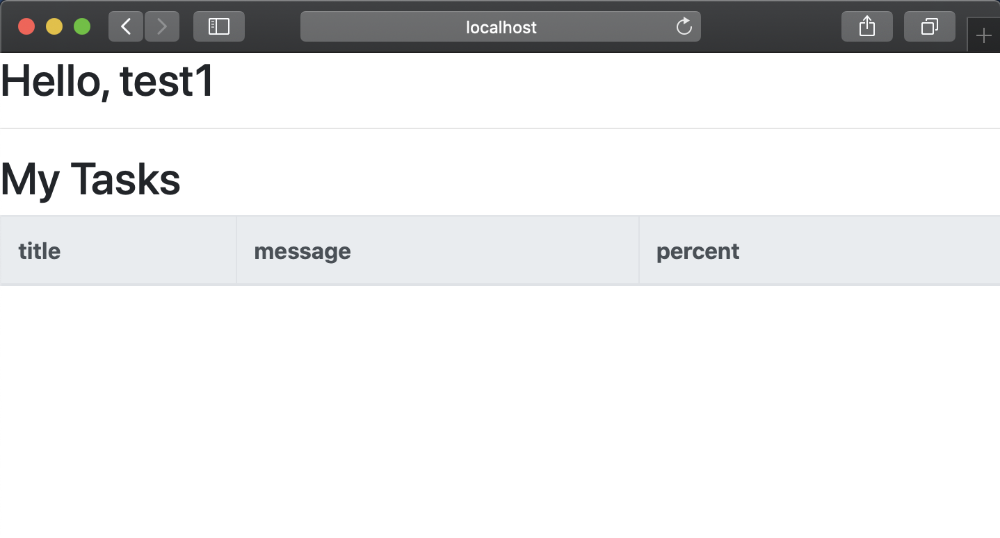

実際にタスクを追加してみましょう.  
この時`select * from users`等で`test1`のidを確認しましょう  
`test1`のidが1のとき
```sql
insert into tasks values (0,'hello','world',0,1);
```
#### result
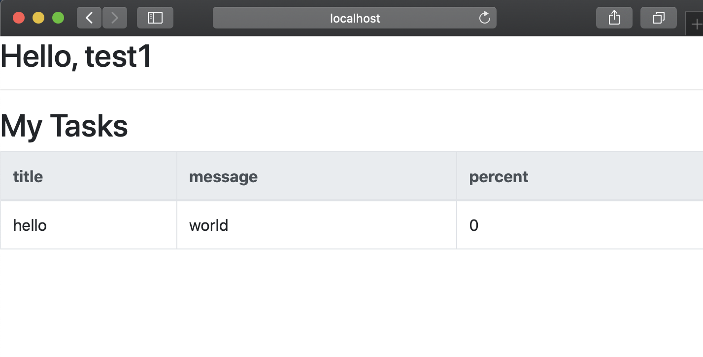

### TIPS : req.isAuthenticated()
>passportの機能のひとつで,アクセスした人がログインしているかどうかを(`True` || `False`) で返すメソッド. ログインの有無を確認する際に使用する.


#### 2. タスクの進捗を設定できるページ
今回は`/mypage`に`POST`をすると進捗度合いを変更できる仕様にします.
`mypage.ejs`のtableを変更
```html
<table class='table table-bordered'>
    <thead class='thead-light'>
        <tr>
            <th>title</th>
            <th>message</th>
            <th>percent</th>
            <th>new percent</th>
        </tr>
    </thead>
    <tbody>
        <% for(let task of tasks){ %>
          <tr>
            <td><%= task.title%></td>
            <td><%= task.message%></td>
            <td><%= task.percent%></td>
            <td>
              <form action="/mypage" method="post">
                <div>
                  <label>percent：</label>
                  <input type="number" name="newPercent" min="0" max="100" value="<%= task.percent%>"/>
                  <input type="hidden" name="taskID" value="<%= task.id%>"/>
                  <input type="hidden" name="target" value="<%= task.target%>"/>
                  <input type="submit" value="Register"/>
                </div>   
              </form>
            </td>
          </tr>
        <% }%>
    </tbody>
</table>
```
`mypage.js`に追加
```js
router.post('/', function(req,res,next){
    console.log(req.body.target,req.user.id);
    if(req.isAuthenticated() && req.body.target == req.user.id){
        let per = req.body.newPercent,
            taskID = req.body.taskID;
        connection.query(`update tasks set percent=${per} where id=${taskID};`,function(err,result,fields){
            if(err){
                //エラー処理
            }
            else{
                res.redirect('/mypage');
            }
        });
    }
    else{
        res.status(404);
        res.end('not found')
    } 
});
```
#### result
POST前
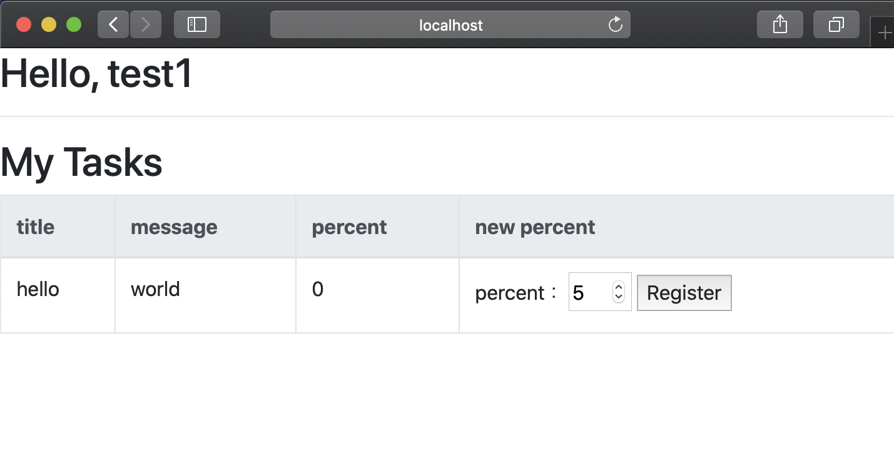
POST後
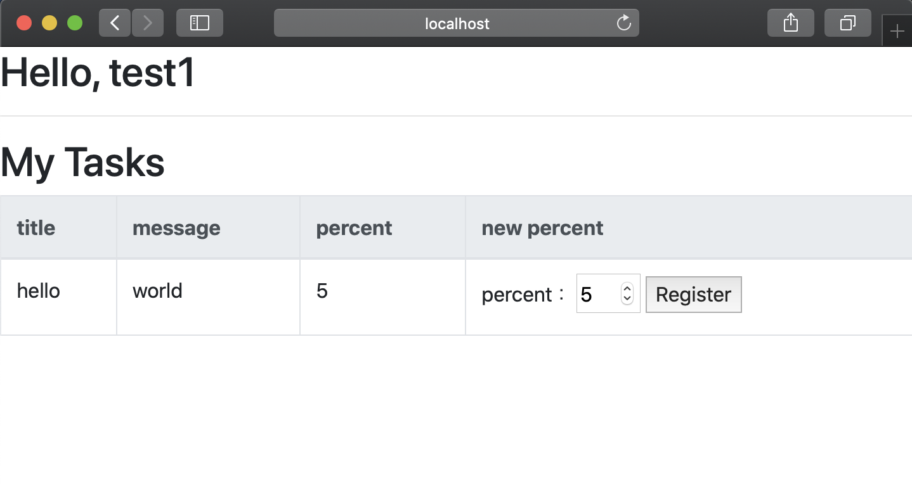
`percent`が変更されていれば成功


#### 3. 管理者のみアクセス可能なタスク生成ページ
管理者のみアクセスできるページは,usersテーブルで定義した`isAdmin`の真偽で処理を分岐させることで作成することができます.

#### Create admin user
今まで作成してきたユーザーは全て一般ユーザーでした. Adminユーザーを作成しましょう.  
```sql
mysql>insert into users value(0,'adminuser','password',True);
```

#### Admin page
`/cretetask`を管理者のみアクセスできるページにします.  
まずはGETリクエストのみ実装します.  

`isAdmin`は`req.user.isAdmin`で確認できます.  
これはログイン処理で使用した`done(null,users[0])`の第2引数の値が`req.user`に格納されるためです.  
`req.user.isAdmin`の真偽でレスポンス内容を変えることで実装します.

まずはアクセスできたら`SUCCESS`と表示されるページを作成しましょう.


`createtask.js`

```js
var express = require('express');
var router = express.Router();
var connection = require('../dbConnect');

router.get('/',function(req,res,next){
    if(req.isAuthenticated() && req.user.isAdmin){
      res.render('createTask',{});
    }
    else{
        res.status(404);
        res.end('not found');
    }
});
module.exports = router;
```
- 通常のログイン確認を行う`req.isAuthenticated()`に加え,Adminであるか確認する`req.user.isAdmin`をif文に追加する
- `else`では`404`を返している

`createtask.ejs`
```html
<!DOCTYPE html>
<html>
    <head>
        <link href="https://stackpath.bootstrapcdn.com/bootstrap/4.3.1/css/bootstrap.min.css" rel="stylesheet">
        <script src="https://code.jquery.com/jquery-3.3.1.slim.min.js" ></script>
        <script src="https://stackpath.bootstrapcdn.com/bootstrap/4.1.2/js/bootstrap.min.js"></script>
    </head>
    <body>
        <h1>SUCCESS</h1>
    </body>
</html>
```

### TIPS : include 
>`mypage.ejs`と`createtask.ejs`の`<head></head>`が同じ  
>ejsの**共通部分は別ファイルに記述**し,読み込むことができる  
>
>`header.ejs`
>```html
><head>
>    <link href="https://stackpath.bootstrapcdn.com/bootstrap/4.3.1/css/bootstrap.min.css" rel="stylesheet">
>    <script src="https://code.jquery.com/jquery-3.3.1.slim.min.js" ></script>
>    <script src="https://stackpath.bootstrapcdn.com/bootstrap/4.1.2/js/bootstrap.min.js"></script>
></head>
>```
>別ファイルで読み込む場合  
>```html
><%- include('./header'); %>
>```
>`<head></head>`を記述していた箇所を置き換えることができる

#### result
`adminuser`でログインして確認してみましょう.

- 管理者権限が無い,またはログインしていない場合  

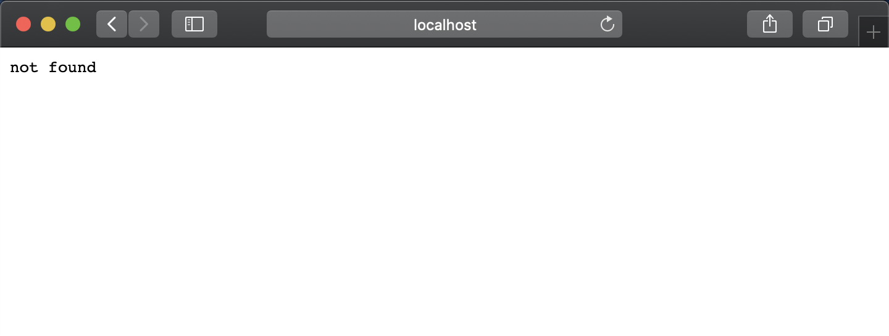

- 管理者権限がある場合

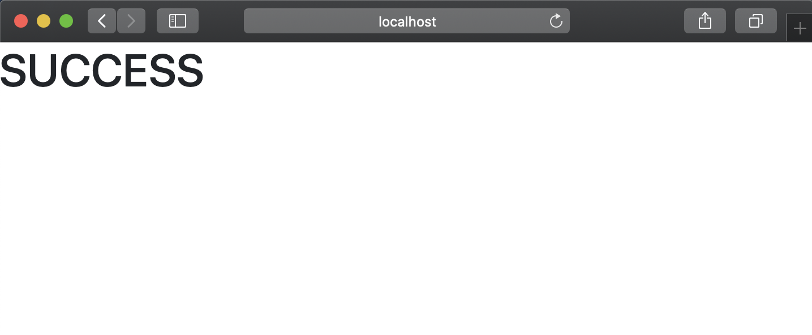


#### 実装
`createtask`ではタスクの`対象者`,`タイトル`,`内容`をtasksテーブルに登録します.

`POST`リクエストでこれらの項目を登録できるように実装します.

`createtask.js`
```js
var express = require('express');
var router = express.Router();
var connection = require('../dbConnect');

router.get('/',function(req,res,next){
    if(req.isAuthenticated() && req.user.isAdmin){
        connection.query('select id,username from users;',function(err,result,fields){
            if(err){
                //エラー処理
            }
            else{
                let users = Object.values(JSON.parse(JSON.stringify(result)));
                res.render('createTask',{'users':users});
            }
        });
    }
    else{
        res.status(404);
        res.end('not found');
    }
});

router.post('/', function(req,res,next){
    if(req.isAuthenticated() && req.user.isAdmin){
        let title = req.body.title,
            message = req.body.message,
            targetID = req.body.target;
        connection.query(`insert into tasks values (0,'${title}','${message}',0,${targetID});`,function(err,result,fields){
            if(err){
                //エラー処理
            }
            else{
                res.redirect('/mypage');
            }
        });
    }
    else{
        res.status(404);
        res.end('not found')
    }
    
});
module.exports = router;

```

`createtask.ejs`
```html
<!DOCTYPE html>
<html>
    <%- include('./header'); %>
    <body>
        <form action="/createtask" method="post">
            <div>
            <label>Target：</label>
            <select name='target'>
                <% for(let user of users){ %>
                <option value="<%= user.id%>"><%= user.username%></option>
                <% }%>
            </select>
            </div>
            <div>
                <label>Title：</label>
                <input type="text" name="title"/>
            </div>
            <div>
                <label>Message：</label>
                <textarea name="message" cols="50" rows="5"></textarea>
            </div>
            <div>
                <input type="submit" value="Register"/>
            </div>
      </form>
  </body>
</html>

```

#### result

`/createtask`でこの内容を登録し
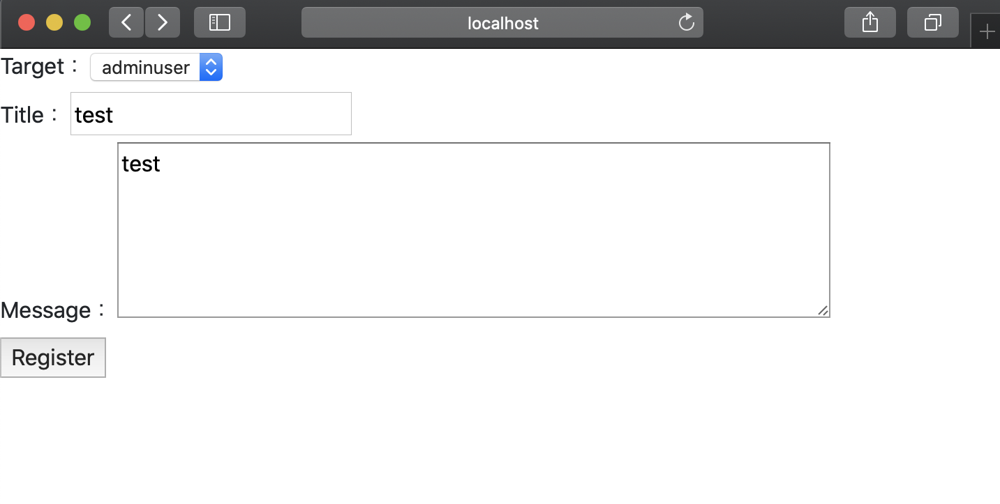

このようになれば成功
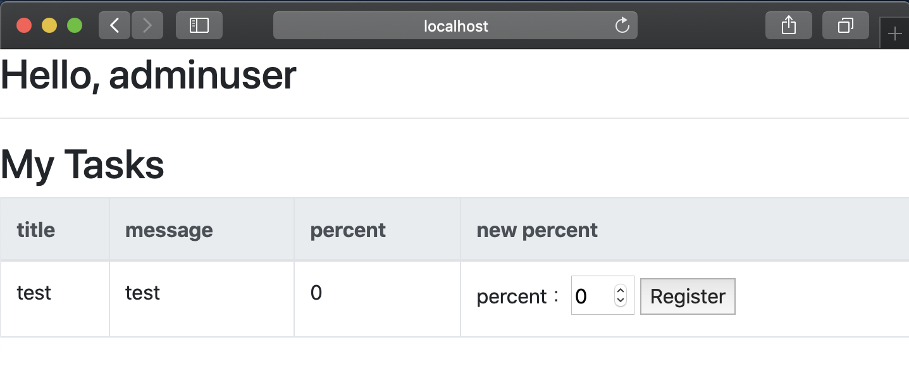


これでTodoアプリの機能面の実装は完了です.

## 11. Make Navbar

Todoアプリは完成しましたが,使いづらいアプリになっています.  
そこで`bootstrap4`のナビケーションバーを用い使いやすいアプリにします.


TIPSで<head>を纏めたときに使用した`header.ejs`にナビゲーションバーを実装します.

`header.ejs`
```html
<head>
    <link href="https://stackpath.bootstrapcdn.com/bootstrap/4.3.1/css/bootstrap.min.css" rel="stylesheet">
    <link href="https://use.fontawesome.com/releases/v5.6.1/css/all.css" rel="stylesheet">
    <script src="https://code.jquery.com/jquery-3.3.1.slim.min.js" ></script>
    <script src="https://stackpath.bootstrapcdn.com/bootstrap/4.1.2/js/bootstrap.min.js"></script>
    <script src="https://cdnjs.cloudflare.com/ajax/libs/popper.js/1.14.3/umd/popper.min.js"></script>
</head>
<header>
    <nav class="navbar navbar-expand-md navbar-dark bg-dark">
        <a href="/" class="navbar-brand">TodoApp</a>
        <button type="button" class="navbar-toggler" data-toggle="collapse" data-target="#navi-items" aria-controls="navi-items" aria-expanded="false" aria-label="Toggle navigation">
          <span class="navbar-toggler-icon"></span>
        </button>
        
        <div id="navi-items" class="navbar-collapse collapse hide">
            <ul class="navbar-nav">
              <li class="nav-item">
                <a class="nav-link" href="/">Top</a>
              </li>
            </ul>
            <ul class="nav navbar-nav ml-auto">
            <%if(!isAuth)else%>
            </ul>
        </div>
    </nav>
</header>
```
このNavbarの仕様
- バーに[fontawesome](https://fontawesome.com)のアイコンを使用しています.
- `isAuth:req.isAuthenticated()`をレスポンスの連想配列に加える必要があります.  
ex)`index.js`
`res.render`に`isAuth`のパラメータを追加
```js
var express = require('express');
var router = express.Router();

/* GET home page. */
router.get('/', function(req, res, next) {
  res.render('index', {title: 'Express',isAuth:req.isAuthenticated()});
});

module.exports = router;

```